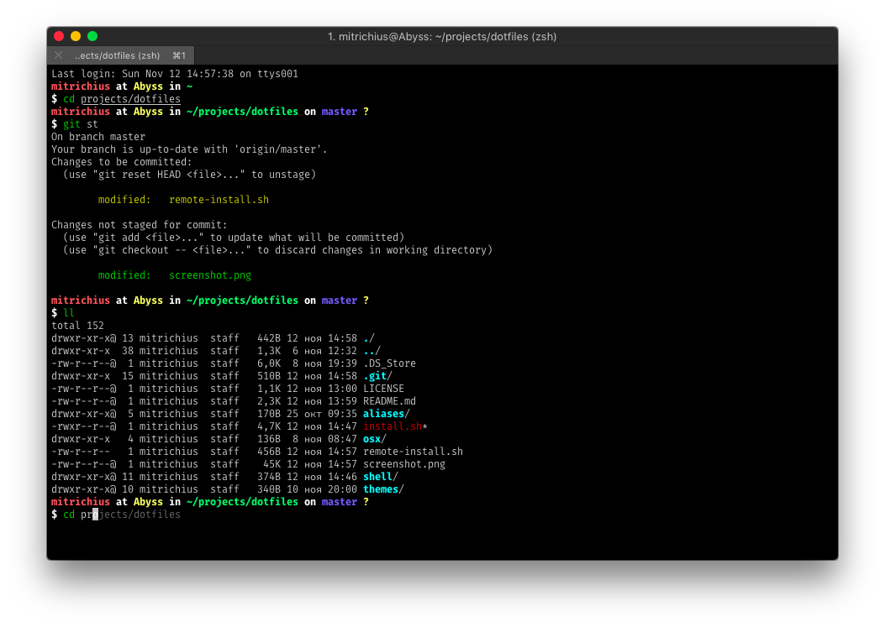

# Dmitry Kolosov's dotfiles

This is a collection of dotfiles and scripts I use for customizing working environment on OS X and Linux.



## Features 
- Settings for bash and zsh, including aliases and themes
- Settings for git (create `~/.gitconfig.local` to override it)
- Settings for tmux
- Settings and theme for vim 
- Settings for OS X (defaults and ssd)
- Simple customization
- Installation via symlinks (in most cases), with simple update
- Zsh automatic installation with oh-my-zsh and few plugins
- Software themes: alfred, jetbrains, sequel-pro, sublime-text, telegram
 
## Installation

### Options
- q: for quiet install (bash mode)

### Requirements
- Curl for oh-my-zsh installation
- Git for zsh plugins installation

### Manual
```sh
$ git clone https://github.com/mitrichius/dotfiles.git ~/dotfiles
$ cd ~/dotfiles
$ chmod +x install.sh
$ ./install.sh
```

### Via curl
```sh
bash -c "`curl -fsSL https://raw.github.com/mitrichius/dotfiles/master/remote-install.sh`"
```

### Via wget
```sh
bash -c "`wget -O - --no-check-certificate https://raw.githubusercontent.com/mitrichius/dotfiles/master/remote-install.sh`"
```

## Customize

### Local Settings

The dotfiles can be easily extended to suit additional local
requirements by using the following files:

- `~/.bashrc.local`
- `~/.zshrc.local`
- `~/.gitconfig.local`

**Note:** Use `~/.gitconfig.local` to store sensitive information such
as the `git` user credentials, e.g.:

```sh
[user]
  name = Dmitry Kolosov
  email = mitrichius@gmail.com
```

## Credits
- **Dotfiles**: based on [nicksp-dotfiles](https://github.com/nicksp/dotfiles) and [bndabbs-dotfiles](https://github.com/bndabbs/dotfiles)
- **Alfred**: Clean Dark Theme v2 by k9ordon
- **JetBrains**: Twilight theme with some customization
- **Sequel Pro**: [Twilight color theme by DOM111](https://dom.hastin.gs/blog/coding/sequelpro-twilight-theme/252)
- **Sublime Text**: [Broceanic theme by kenwheeler](https://github.com/kenwheeler/broceanic-theme) and [Oceanic Next Color Scheme by voronianski](https://github.com/voronianski/oceanic-next-color-scheme)
- **Telegram**: [Night Mode by CristianOspina](https://t.me/NightModeTheme)
- **Vim**: [vim-code-dark theme by tomasiser](https://github.com/tomasiser/vim-code-dark)

## License
The code is available under the [MIT license](LICENSE).